# 🚀 Proyecto End-to-End Data Engineering (Event-Driven Pipeline)

    !

## 📋 Descripción del Proyecto

Este proyecto implementa un pipeline de datos completo (End-to-End) simulando un entorno de comercio electrónico real. La arquitectura está diseñada para ser **Event-Driven** (orientada a eventos), escalable y gestionada íntegramente mediante código (IaC).

El flujo abarca desde la generación de transacciones en sistemas operacionales, su ingesta en tiempo real, almacenamiento en Data Lakehouse, transformación de datos y visualización final para la toma de decisiones.

---

## 1️⃣ Arquitectura de la Solución

El diseño sigue un patrón **ELT (Extract, Load, Transform)**. Los datos viajan desde las aplicaciones operacionales (Orders/Delivery), pasan por un bus de mensajería (Pub/Sub) para desacoplar servicios, y aterrizan en BigQuery mediante una suscripción nativa (Serverless) para su posterior modelado con dbt.Y finalmente, Metabase se conecta directamente a la DB para mostrar los KPIs en dashboards interactivos, cerrando el ciclo de valor del dato.

> **Diagrama de Arquitectura:**
> 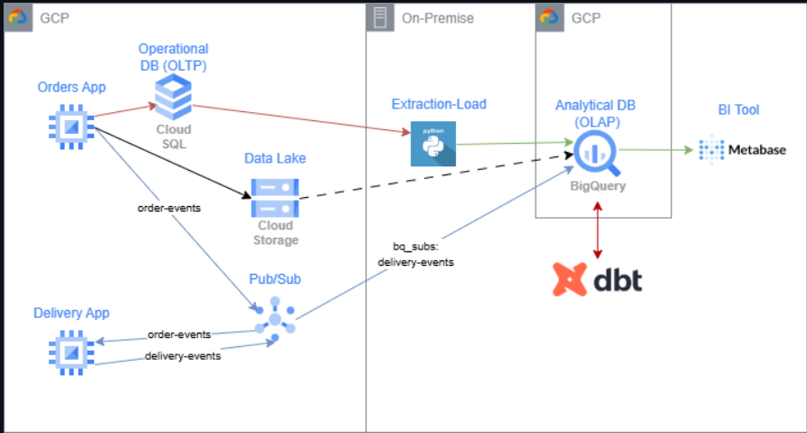

---

## 2️⃣ Definición de Infraestructura (Terraform Deep Dive)

Toda la infraestructura se ha definido utilizando **Terraform**, garantizando la reproducibilidad y el versionado del entorno. A continuación, se detalla la lógica implementada en el código `.tf`.

### A. Computación Inmutable (VMs)
Se utiliza el recurso `google_compute_instance_from_machine_image` para instanciar las aplicaciones. En lugar de configurar servidores vacíos, se parte de una **Golden Image** preconfigurada (creada desde la consola), lo que asegura que los entornos de producción (`orders` y `delivery`) sean idénticos y reduce el tiempo de arranque.

> *Código Terraform: Definición de instancias basadas en imagen maestra.*
> 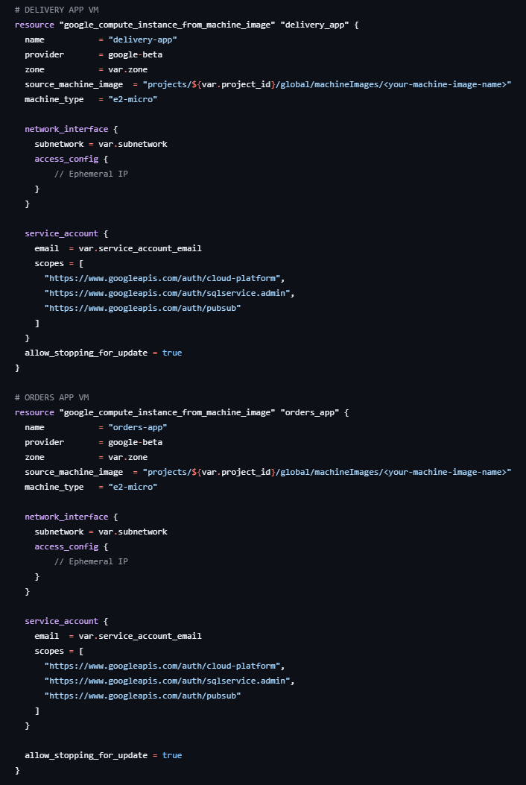

### B. Capa de Mensajería y Base de Datos Transaccional
Se provisionan los canales de comunicación (`google_pubsub_topic`) y la persistencia operacional (`google_sql_database_instance`). La base de datos PostgreSQL se despliega con usuarios y esquemas predefinidos, automatizando el setup inicial.

> *Código Terraform: Creación de Topics y Cloud SQL.*
> 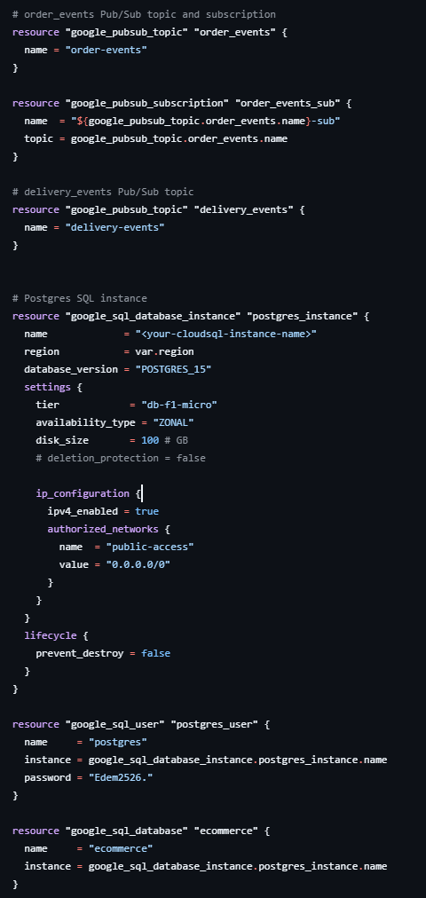

### C. Estructura del Data Warehouse (Datasets)
Terraform organiza BigQuery creando los contenedores lógicos (`orders_bronze`, `delivery_bronze`) y define tablas maestras (`customers`, `products`) con esquemas fuertemente tipados para garantizar la integridad de los datos desde el origen.

> *Código Terraform: Datasets y Tablas Maestras.*
> 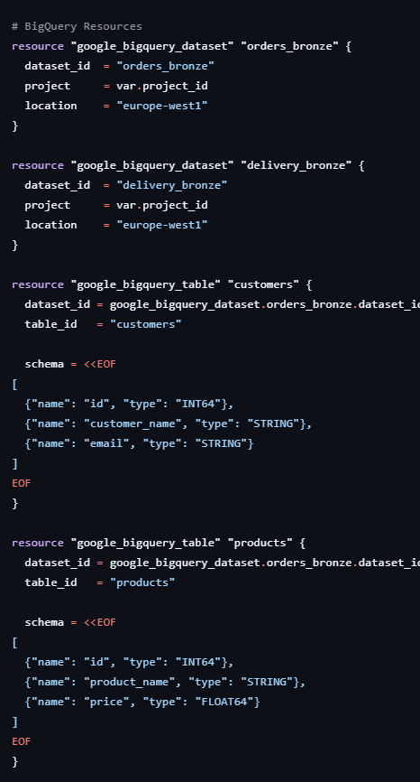

### D. Tablas de Hechos y Eventos Crudos (ELT)
Se definen tablas como `raw_events_delivery` preparadas para ingestar datos semi-estructurados (JSON). Esto habilita el paradigma ELT, permitiendo cargar el dato crudo primero y transformarlo después.

> *Código Terraform: Tablas Transaccionales.*
> 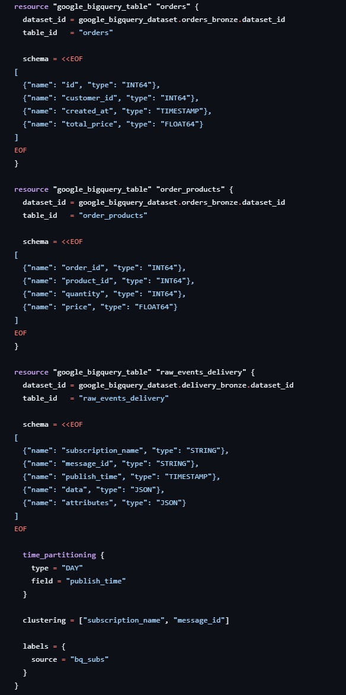

### E. Ingesta Streaming Serverless
Se implementa una integración nativa entre Pub/Sub y BigQuery (`bigquery_config`). Esto elimina la necesidad de mantener código intermedio (como Dataflow) para la ingesta simple, reduciendo latencia y costes. Se incluye una **Dead Letter Queue** para manejar mensajes fallidos.

> *Código Terraform: Suscripción directa a BigQuery.*
> 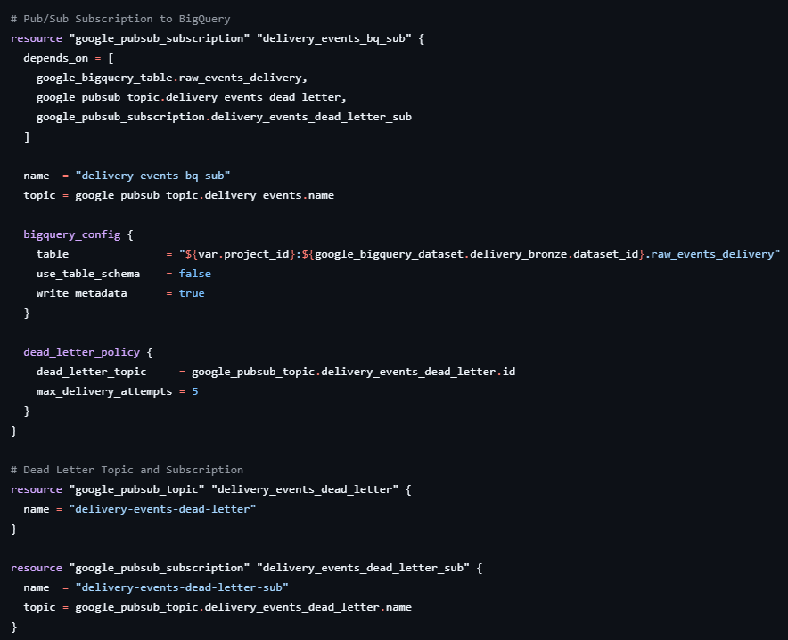

---

## 3️⃣ Despliegue y Aprovisionamiento

Una vez definido el código, se ejecutó el ciclo de vida de Terraform para materializar la infraestructura en la región `europe-west1`.

### Inicialización y Plan
> *Inicialización del backend y proveedores.*
> 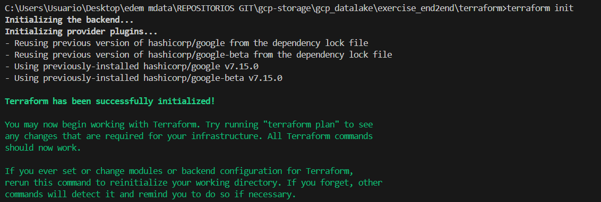
>
> *Plan de ejecución confirmando los recursos a crear (Idempotencia ).*
> 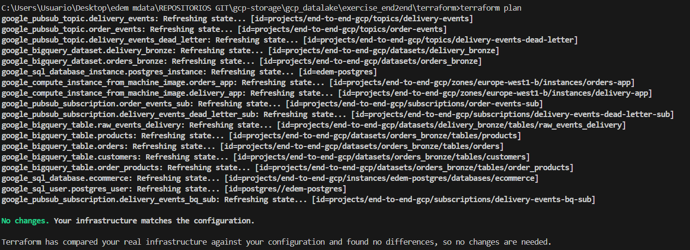

### Recursos Desplegados (Compute Engine)
Se levantaron las instancias `orders-app` y `delivery-app` en europe-west1-b, basadas en la imagen de máquina creada previamente.

> *Instancias activas en GCP:*
> 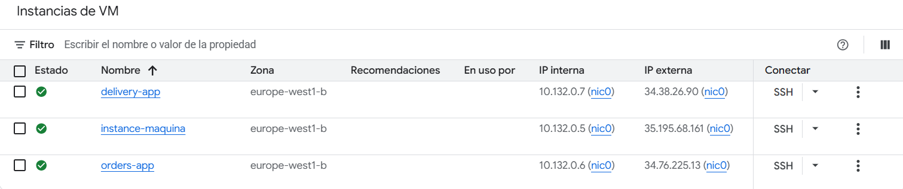
>
> *Imagen de Máquina (Golden Image) utilizada como plantilla:*
> 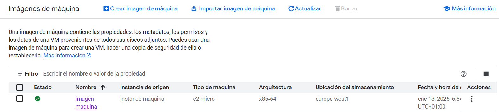

---

## 4️⃣ Fuente de Datos y Generación de Eventos

### Base de Datos Operacional (OLTP)
La instancia de **Cloud SQL (PostgreSQL)** actúa como fuente de verdad para los datos de clientes.
> *Tabla `customers` poblada en PostgreSQL:*
> 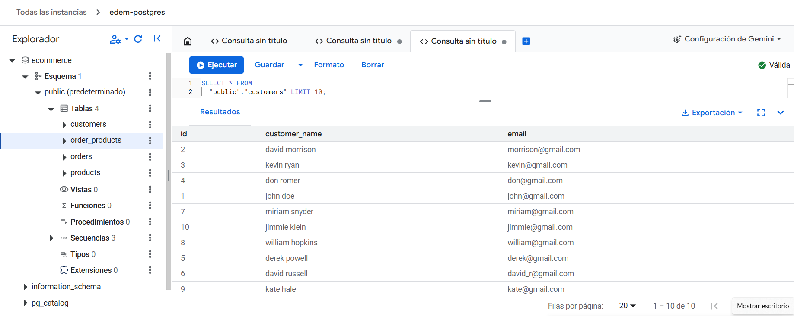

### Arquitectura Orientada a Eventos (Pub/Sub)
Las aplicaciones generan eventos en tiempo real que son enviados a los tópicos de Pub/Sub, desacoplando la generación del procesamiento.
> *Topics configurados (`order-events`, `delivery-events`):*
> 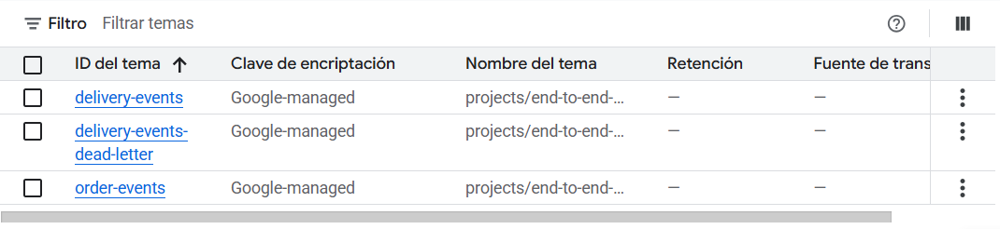
>
> *Suscripciones activas recibiendo tráfico:*
> 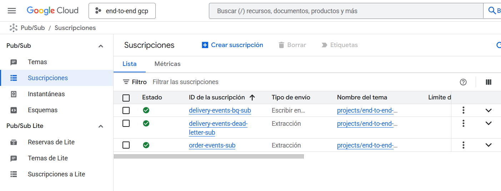

---

## 5️⃣ Ejecución del Pipeline en Tiempo Real

Mediante scripts de Python ejecutándose en las VMs, se simula la actividad del negocio. Los logs confirman el flujo completo: Generación -> Inserción en DB -> Publicación en Pub/Sub -> Consumo.

> *Logs en tiempo real de `orders-app`:*
> 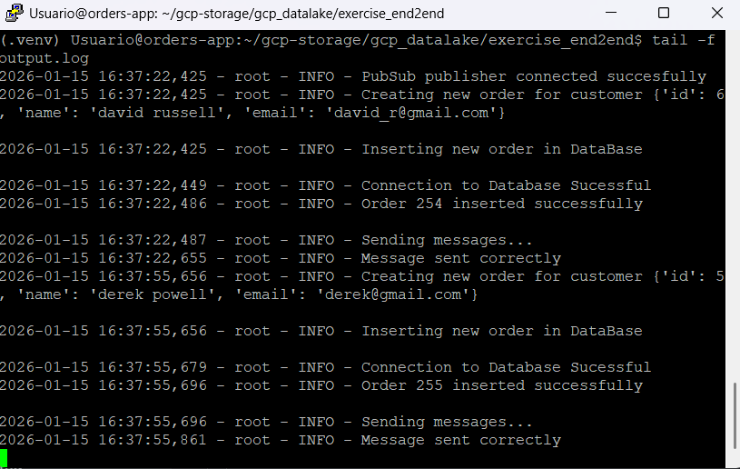
>
> *Logs en tiempo real de `delivery-app`:*
> 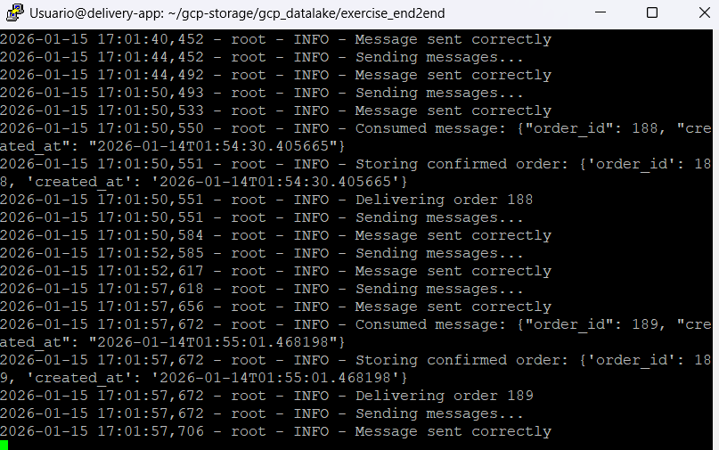
>
> *Evidencia de mensajes JSON llegando a las suscripciones:*
> 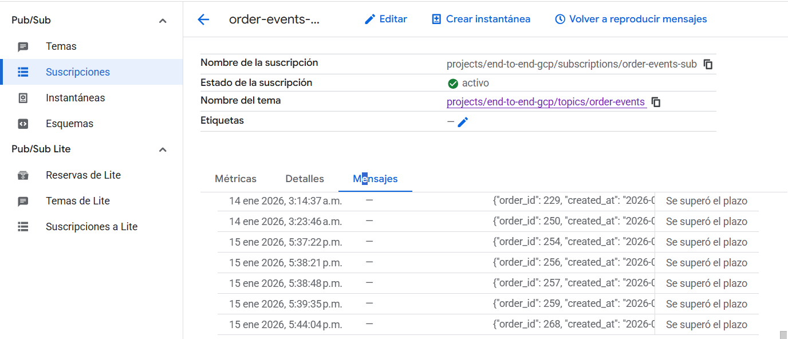
> 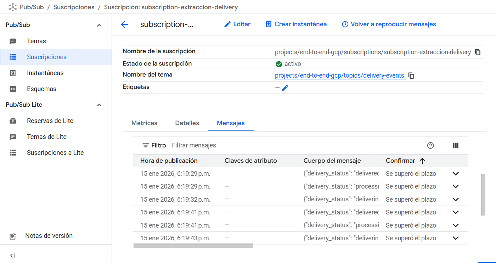

---

## 6️⃣ Almacenamiento y Transformación (Data Warehouse)

Los datos aterrizan en **Google BigQuery**. Se ha seguido una arquitectura de capas (Bronze/Silver/Gold) gestionada mediante **dbt**.

* **Bronze:** Ingesta cruda (tablas externas y streaming).
* **Gold:** Tablas de negocio agregadas (`orders_per_customer`, `top_5_products`).

> *Esquema final en BigQuery con las tablas analíticas generadas:*
> 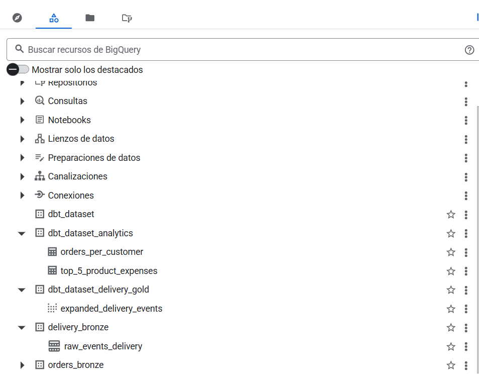

---

## 7️⃣ Visualización e Inteligencia de Negocio (BI)

Finalmente, se expone el valor de los datos mediante **Metabase**, desplegado localmente con Docker y conectado al Data Warehouse.

> *Infraestructura Local (Docker):*
> 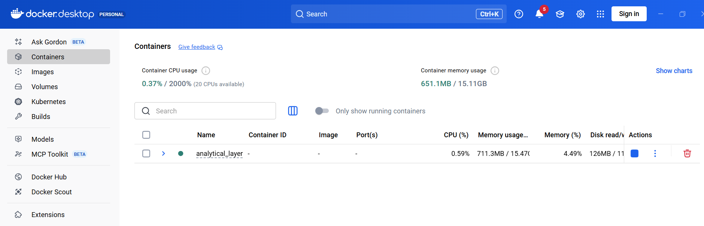

### Dashboards de Negocio
Los datos transformados permiten responder preguntas clave del negocio en tiempo real.

> *Conexión a los Datasets:*
> 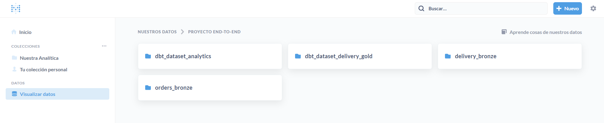
>
> **KPI 1: Volumen de Pedidos por Cliente**
> 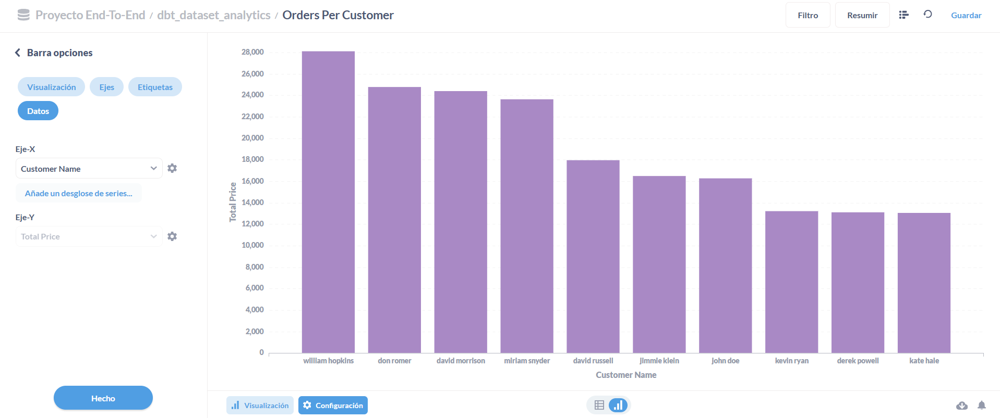
>
> **KPI 2: Top 5 Productos por Ingresos**
> 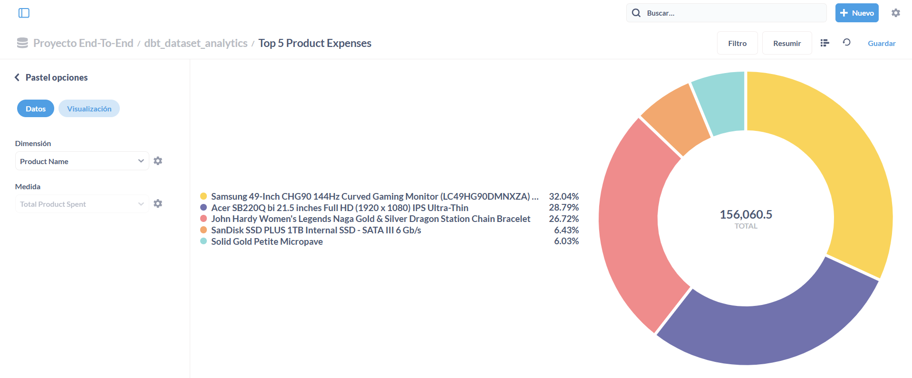

---

## 🏁 Conclusiones

Este proyecto demuestra la capacidad para diseñar y operar una plataforma de datos moderna, integrando infraestructura como código, ingestión serverless y modelado analítico avanzado.