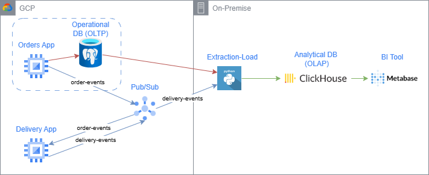
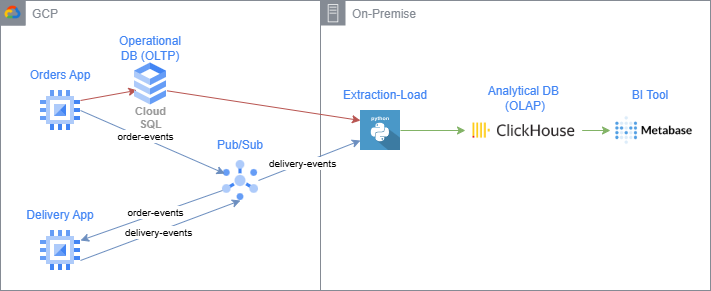

# Exercise with GCP Resources

We will work on the migration of our operational DB (PostgreSQL) that we used in the module `GCP Setup` to Cloud SQL.

Going from this architecture:


To this:


-----------------------------

# STEPS WITHOUT TERRAFORM

So first, let's rebuild what we have already done in our previous end-to-end exercise.

## Create a pub/sub topic

PubSub is a messaging service that allows you to send and receive messages between independent applications. It is similar to Kafka, but it is a managed service.

To create a PubSub topic in the UI, follow these steps:

1. Go to pub/sub in the console.
2. Click on `Create Topic`.
3. Name the topic `order-events`.
4. Add another topic called `delivery-events`.

## Create the instance for the `orders-app`

```sh
gcloud compute instances create orders-app \
  --zone=europe-west1-b \
  --scopes=https://www.googleapis.com/auth/cloud-platform \
  --subnet=projects/<your-project-id>/regions/europe-west1/subnetworks/default \
  --machine-type=e2-micro \
  --source-machine-image=projects/<your-project-id>/global/machineImages/<your-machine-image-name> \
  --boot-disk-size=10GB
```


## Create the instance for the `delivery-app`

```sh
gcloud compute instances create delivery-app \
  --zone=europe-west1-b \
  --scopes=https://www.googleapis.com/auth/cloud-platform \
  --subnet=projects/<your-project-id>/regions/europe-west1/subnetworks/default \
  --machine-type=e2-micro \
  --source-machine-image=projects/<your-project-id>/global/machineImages/<your-machine-image-name> \
  --boot-disk-size=10GB
```

-----------------------------

# STEPS WITH TERRAFORM

## Create a bucket to store the terraform state

```sh
gcloud storage buckets create gs://edem-terraform-state \
  --location=europe-west1 \
  --uniform-bucket-level-access
```

## Move to the terraform directory

```sh
cd gcp_sql/exercise_e2e/terraform
```

## Modify the variables in the terraform files

Watch out for variables in the files indicated with `<...>` and replace them with the values from your GCP project.

## Initialize the terraform directory

```sh
terraform init
terraform plan
```

## Create the infrastructure

```sh
terraform apply
```

Once we finished the exercise, we can destroy the infrastructure by running:

```sh
terraform destroy
```
-----------------------------


## Create the required tables inside the PostgresDB instance

First, create a new database in the UI of Cloud SQL. Go to database, click on `Create Database` and call it `ecommerce`.

To create the tables inside the PostgresDB instance, you need to connect to the PostgresDB instance using Cloud SQL Studio, and run the following SQL commands:

```sql
CREATE TABLE IF NOT EXISTS customers (
    id SERIAL PRIMARY KEY,
    customer_name VARCHAR(255) NOT NULL,
    email VARCHAR(255) UNIQUE NOT NULL
);

CREATE TABLE IF NOT EXISTS products (
    id SERIAL PRIMARY KEY,
    product_name VARCHAR(255) NOT NULL,
    price DECIMAL(10, 2) NOT NULL
);

CREATE TABLE IF NOT EXISTS orders (
    id SERIAL PRIMARY KEY,
    customer_id INT NOT NULL,
    created_at TIMESTAMP NOT NULL,
    total_price DECIMAL(10, 2) NOT NULL,
    FOREIGN KEY (customer_id) REFERENCES customers(id) ON DELETE CASCADE
);

CREATE TABLE IF NOT EXISTS order_products (
    order_id INT NOT NULL,
    product_id INT NOT NULL,
    quantity INT NOT NULL,
    price DECIMAL(10, 2) NOT NULL,
    PRIMARY KEY (order_id, product_id),
    FOREIGN KEY (order_id) REFERENCES orders(id) ON DELETE CASCADE,
    FOREIGN KEY (product_id) REFERENCES products(id) ON DELETE CASCADE
);
```


### In both instances

1. Log in to the instance:
   ```sh
   gcloud compute ssh <instance-name> --zone=europe-west1-b
   ```

2. Clone this repository:
   ```sh
   git clone https://github.com/frkroe/gcp-storage.git
   ```

3. Move to the correct directory:
   ```sh
   cd gcp-storage/gcp_sql/exercise_e2e
   ```

4. Create a virtual environment:
   ```sh
   python3 -m venv .venv
   ```

5. Activate the venv:
   ```sh
   source .venv/bin/activate
   ```

6. Install the requirements:
   ```sh
   pip install -r requirements.txt
   ```

### For the `orders-app` instance


1. Run the `orders-app` using nohup so that it runs in the background (if you close the terminal, the app will still be running):
   ```sh
   nohup bash -c 'HOST_IP=<your-cloud-sql-ip> PROJECT_ID=<your-project-id> python -m orders_app.orders_to_db.main' > output.log 2>&1 &
   ```

This will start creating orders, store them in the database and publish confirmation events to the `order-events` topic.

If you want to see the logs, run the following command:
```sh
tail -f output.log
```


### For the `delivery-app` instance

1. Run the following command to start the `delivery-app`:
   ```sh
   nohup bash -c 'PROJECT_ID=<your-project-id> python -m delivery_app.main' > output.log 2>&1 &
   ```

If you want to see the logs, run the following command:
```sh
tail -f output.log
```

This will start consuming the events from the `order-events` topic and publish delivery events to the `delivery-events` topic.


## **Extra exercise: Use the analytical-layer**

Once you have the `orders-app` and the `delivery-app` running, you can also deploy the `analytical-layer` to process the delivery events and store them in ClickHouse in your local machine as we did in the GCP Setup end2end exercise.

To do this, we need a few steps

1. Go to the GCP Setup directory in your local machine:
   ```sh
   cd path/to/gcp-setup/end2end
   ```

2. Create the venv, activate it and install the requirements:
   ```sh
   python -m venv .venv
   source .venv/bin/activate
   pip install -r requirements.txt
   ```

3. Deploy the docker-compose of the analytical-layer:
   ```sh
   cd analytical-layer
   docker-compose up -d
   ```

Now that we have both the ClickHouse and Metabase running, we can deploy the EL pipeline to synchronize the PostgresDB and the Events from PubSub in two different ways.


### Running directly the script in our machine

To do so, we need to run the following commands:

1. Create your application-default credentials. This will allow us to identify to the GCP services with our user account:
   ```sh
   gcloud auth application-default login
   ```

2. Run the script to synchronize the PostgresDB database inside the gcp-setup/end2end directory:
   ```sh
   HOST_IP=localhost POSTGRES_IP=<postgres-ip>  python -m analytical_layer.el_orders.main
   ```

   If you are using Windows CMD, you can run:

   ```sh
   set HOST_IP=localhost
   set POSTGRES_IP=<postgres-ip>
   python -m analytical_layer.el_orders.main
   ```


   If you are using Windows PowerShell, you can run:

   ```sh
   $env:HOST_IP = "localhost"; $env:POSTGRES_IP = "<postgres-ip>"; python -m analytical_layer.el_orders.main
   ```

3. To syncronize the events of the delivery app, you can run the following command:

   ```sh
   HOST_IP=localhost PROJECT_ID=<your-project-id> python -m analytical_layer.el_delivery.main
   ```

   If you are using Windows CMD, you can run:
   ```sh
   set HOST_IP="localhost"
   set PROJECT_ID="<your-project-id>"
   python -m analytical_layer.el_delivery.main
   ```

   If you are using Windows PowerShell, you can run:
   ```sh
   $env:HOST_IP = "localhost"; $env:PROJECT_ID = "<your-project-id>"; python -m analytical_layer.el_delivery.main
   ```

### Use the Docker image with the cronjob


1. To identify ourselves inside the Docker Container, we need to create a Service Account in GCP to allow the `analytical-layer` to consume the `delivery-events` topic.

   To do this, follow these steps:
   1. Go to the `IAM & Admin` section in the GCP console.
   2. Click on `Service Accounts`.
   3. Click on `Create Service Account`.
   4. Name the service account `pub-sub-get-subscription`.
   5. Add the role `Pub/Sub Subscriber`.
   6. Click on `Create`.
   7. Click on the service account you just created.
   8. Click on `Add Key`.
   9. Select `JSON` and click on `Create`.
   10. Copy the path of the JSON file you just downloaded.

2. Build the Docker image:
   ```sh
   docker build -t analytical-layer-cron -f analytical_layer/docker/DockerFile .
   ```

3. Run the following command (remember to change the variables within <> by your own values):
   ```sh
   docker run --network analytical_layer_default \
   -e PROJECT_ID=<your-project-id> \
   -e POSTGRES_IP=<postgres-ip> \
   -e HOST_IP=<clickhouse-docker-container-ip> \
   -v <path-to-your-pub-sub-sa>:/app/pub-sub-credentials.json \
   -e GOOGLE_APPLICATION_CREDENTIALS=/app/pub-sub-credentials.json \
   analytical-layer-cron
